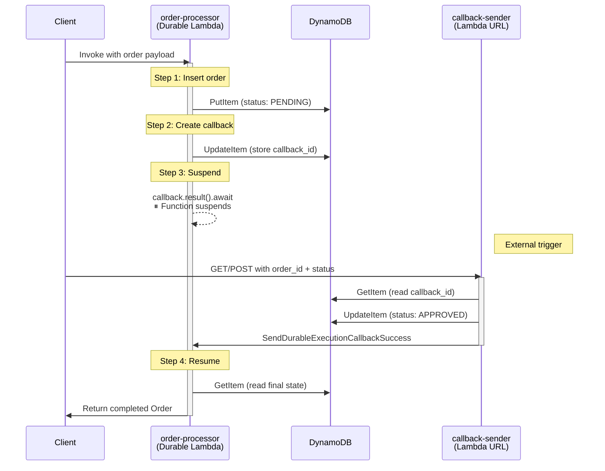
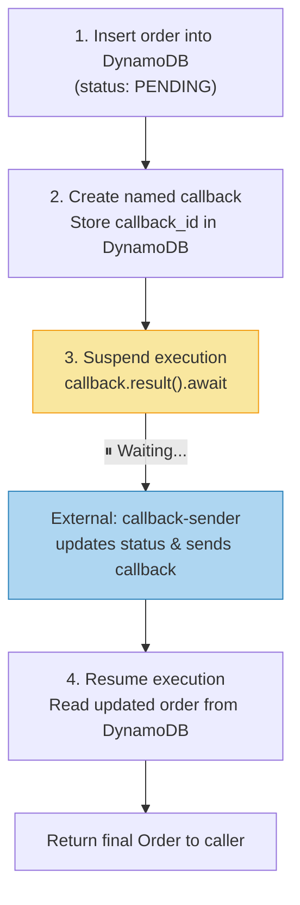

# Rust Durable Functions on AWS Lambda

Running AWS Lambda Durable Execution with the Rust runtime using a CloudFormation escape hatch.

### Author

**[Luis Carlos Osorio Jayk](https://www.linkedin.com/in/luiscarlososoriojayk/)** · [luiscarlosjayk@gmail.com](mailto:luiscarlosjayk@gmail.com)

## Overview

[AWS Lambda Durable Execution](https://docs.aws.amazon.com/lambda/latest/dg/durable-execution.html) enables long-running, stateful workflows that can suspend and resume across invocations. Functions can pause mid-execution waiting for an external callback, then pick up exactly where they left off — with exactly-once step semantics.

**The problem:** AWS officially supports Durable Execution only for Node.js and Python runtimes. CloudFormation rejects `DurableConfig` on custom runtimes.

**This repo's solution:** A CDK L1 escape hatch that tricks CloudFormation into accepting `DurableConfig` on a Rust Lambda, while still executing the Rust binary at runtime.

## Architecture



## The Hack: How It Works

AWS CDK's `cargo-lambda-cdk` creates Lambdas with `provided.al2023` (custom runtime). CloudFormation rejects `DurableConfig` on custom runtimes. The workaround uses a **CDK L1 escape hatch** to override the CloudFormation resource properties after synthesis:

```typescript
// L1 escape hatch: override runtime so CloudFormation accepts DurableConfig
const cfnFunc = ordersProcessorLambda.node
    .defaultChild as cdk.CfnResource;
cfnFunc.addPropertyOverride("Runtime", "nodejs24.x");
cfnFunc.addPropertyOverride("Handler", "index.handler");
```

This tells CloudFormation the function is Node.js, so it accepts `DurableConfig`. But the function still runs the Rust binary because:

1. **`cargo-lambda-cdk`** compiles the Rust code and packages it as `bootstrap` in the Lambda deployment artifact
2. The environment variable **`AWS_LAMBDA_EXEC_WRAPPER: "/var/task/bootstrap"`** tells Lambda to execute the Rust binary as a wrapper script before the "Node.js handler"
3. The Rust binary takes over completely — Lambda never actually runs `index.handler`

The CDK builder configures the durable settings through the standard API:

```typescript
const ordersProcessorLambda = new RustLambdaFunctionBuilder(this, "OrderProcessorLambda", {
    name: "order-processor",
    environment,
})
    .withManifest("order-processor")
    .withEnvironmentVariables({
        AWS_LAMBDA_EXEC_WRAPPER: "/var/task/bootstrap",
    })
    .withDurableConfig({
        executionTimeout: cdk.Duration.hours(1),
        retentionPeriod: cdk.Duration.days(3),
    })
    .withManagedPolicy(
        iam.ManagedPolicy.fromAwsManagedPolicyName(
            "service-role/AWSLambdaBasicDurableExecutionRolePolicy",
        ),
    )
    .build();
```

## Project Structure

```
rust-durable-functions/
├── cdk/                                    # AWS CDK infrastructure (TypeScript)
│   ├── bin/index.ts                        # CDK app entry point
│   ├── lib/
│   │   ├── stacks/lab/index.ts             # Stack: DynamoDB + Lambdas + the hack
│   │   └── constructs/lambda/
│   │       └── rust-lambda-function-builder.ts  # Builder for Rust Lambdas with durable support
│   └── package.json
├── src/lambda/rust/                        # Rust workspace
│   ├── Cargo.toml                          # Workspace config (edition 2024)
│   ├── order-processor/src/main.rs         # Durable function: order workflow
│   ├── callback-sender/src/main.rs         # HTTP Lambda: sends durable callbacks
│   └── shared/src/lib.rs                   # Shared types (OrderStatus enum)
└── LICENSE
```

## The Order Processing Example

The `order-processor` Lambda demonstrates a 4-step durable workflow:



### Key Durable SDK Primitives

**`ctx.step()`** — Wraps a closure for exactly-once execution. On replay, the step returns its previously recorded result instead of re-executing. This prevents duplicate DynamoDB writes.

```rust
ctx.step(
    move |_step_ctx| {
        // This runs EXACTLY ONCE, even if the Lambda replays
        db_client.put_item()
            .table_name(ORDERS_TABLE.as_str())
            .item("PK", AttributeValue::S(order_id))
            .item("status", AttributeValue::S(OrderStatus::Pending.to_string()))
            .send().await
    },
    None,
).await?;
```

**`ctx.create_callback_named()` + `callback.result().await`** — Creates a named callback and suspends the function until an external caller sends a result via `SendDurableExecutionCallbackSuccess`.

```rust
let callback = ctx.create_callback_named::<CallbackResult>("order-approval", None).await?;
// Function suspends here — resumes when callback-sender triggers it
let callback_result: CallbackResult = callback.result().await?;
```

## Prerequisites

- [Rust](https://rustup.rs/) with [cargo-lambda](https://www.cargo-lambda.info/)
- [Node.js](https://nodejs.org/) (for CDK)
- [AWS CLI](https://aws.amazon.com/cli/) configured with credentials
- [AWS CDK CLI](https://docs.aws.amazon.com/cdk/v2/guide/cli.html) (`npm install -g aws-cdk`)

## Getting Started

```bash
# Clone the repo
git clone https://github.com/luiscarlosjayk/rust-durable-functions.git
cd rust-durable-functions

# Install CDK dependencies
cd cdk
npm install

# Configure environment
cp .env.example .env
# Edit .env with your AWS_REGION and ENV_NAME

# Deploy
npx cdk deploy
```

### Testing the Workflow

1. **Invoke the order-processor** (via AWS CLI or console):
   ```bash
   aws lambda invoke \
     --function-name <order-processor-function-name> \
     --payload '{"order_id": "order-001", "item_name": "Widget", "quantity": 3}' \
     --cli-binary-format raw-in-base64-out \
     response.json
   ```
   The function will start, insert the order, create a callback, and **suspend**.

2. **Trigger the callback-sender** (via the function URL from stack outputs):
   ```bash
   curl "<callback-sender-url>?order_id=order-001&status=APPROVED"
   ```
   This updates the order status in DynamoDB and sends the durable callback.

3. The `order-processor` **resumes**, reads the updated order, and returns the final result.

## Key Dependencies

| Dependency | Version | Purpose |
|---|---|---|
| `durable-execution-sdk` | 0.1.0-alpha2 | Durable execution primitives (`#[durable_execution]`, `DurableContext`) |
| `lambda_runtime` | 1.0.1 | AWS Lambda Rust runtime |
| `lambda_http` | 1.1.1 | HTTP event handling for callback-sender |
| `aws-sdk-dynamodb` | 1.108.0 | DynamoDB operations |
| `aws-sdk-lambda` | 1 | `SendDurableExecutionCallbackSuccess` API |
| `cargo-lambda-cdk` | 0.0.36 | CDK construct for building/deploying Rust Lambdas |

## Caveats

- **Alpha SDK** — `durable-execution-sdk` is at `0.1.0-alpha2`. The API may change.
- **CloudFormation escape hatch** — The runtime override trick works today, but may break if AWS adds stricter validation that cross-checks the runtime with the deployed artifact.
- **Rust 2024 edition** — The workspace uses `edition = "2024"`, which is still experimental and requires a nightly or recent stable toolchain.

## License

[MIT](LICENSE)
