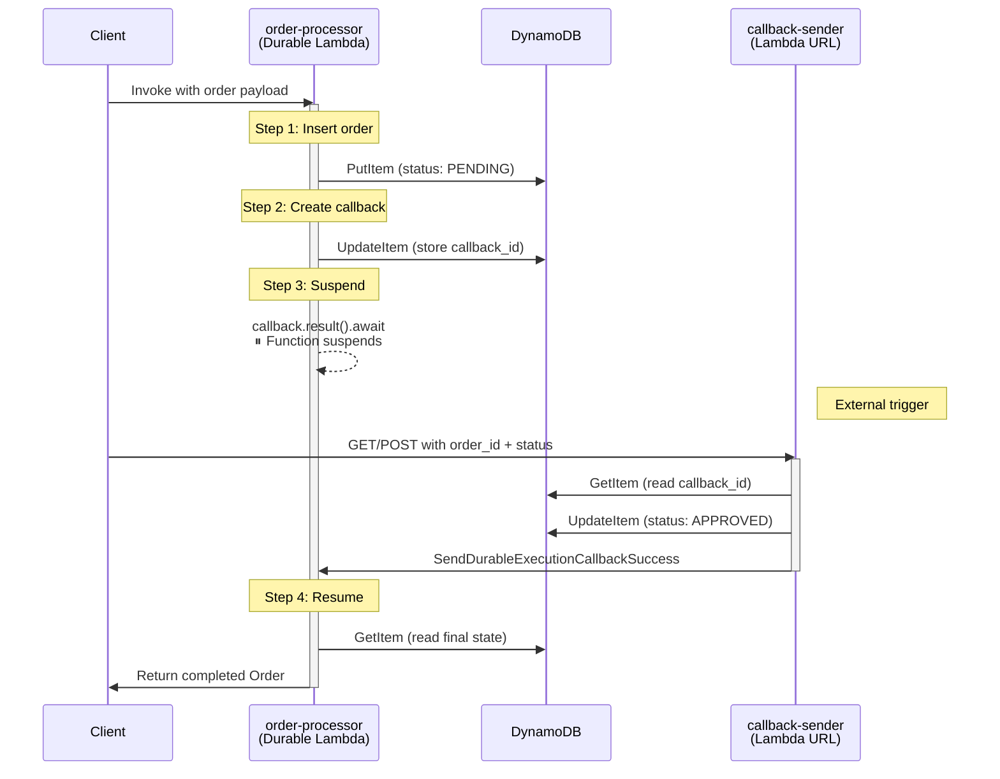
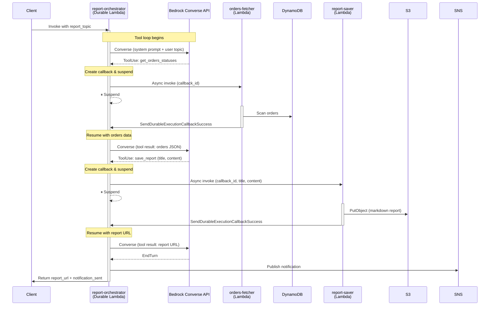
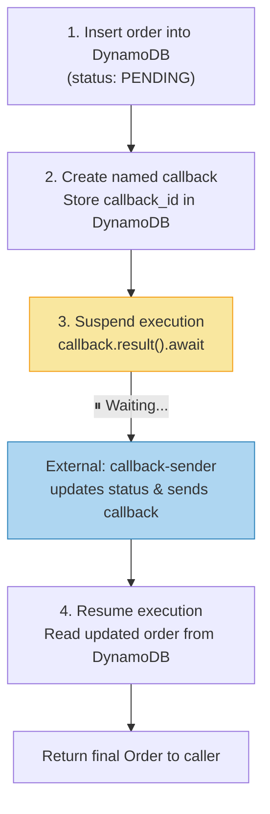

# Rust Durable Functions on AWS Lambda

Running AWS Lambda Durable Execution with the Rust runtime using a CloudFormation escape hatch.

### Author

**[Luis Carlos Osorio Jayk](https://www.linkedin.com/in/luiscarlososoriojayk/)**

## Overview

[AWS Lambda Durable Execution](https://docs.aws.amazon.com/lambda/latest/dg/durable-execution.html) enables long-running, stateful workflows that can suspend and resume across invocations. Functions can pause mid-execution waiting for an external callback, then pick up exactly where they left off — with exactly-once step semantics.

The project demonstrates three patterns: a simple order-processing workflow with suspend/resume callbacks, an AI-agent orchestrator that runs a Bedrock Converse API tool loop on a durable Lambda, and Claude Code CLI running headless on a durable Lambda (with both direct API and Bedrock authentication variants).

**The problem:** AWS officially supports Durable Execution only for Node.js and Python runtimes. CloudFormation rejects `DurableConfig` on custom runtimes.

**This repo's solution:** A CDK L1 escape hatch that tricks CloudFormation into accepting `DurableConfig` on a Rust Lambda, while still executing the Rust binary at runtime.

## Architecture



### Report Orchestrator Flow



## The Hack: How It Works

AWS CDK's `cargo-lambda-cdk` creates Lambdas with `provided.al2023` (custom runtime). CloudFormation rejects `DurableConfig` on custom runtimes. The workaround uses a **CDK L1 escape hatch** to override the CloudFormation resource properties after synthesis:

```typescript
// L1 escape hatch: override runtime so CloudFormation accepts DurableConfig
const cfnFunc = ordersProcessorLambda.node
    .defaultChild as cdk.CfnResource;
cfnFunc.addPropertyOverride("Runtime", "nodejs24.x");
cfnFunc.addPropertyOverride("Handler", "index.handler");
```

This tells CloudFormation the function is Node.js, so it accepts `DurableConfig`. But the function still runs the Rust binary because:

1. **`cargo-lambda-cdk`** compiles the Rust code and packages it as `bootstrap` in the Lambda deployment artifact
2. The environment variable **`AWS_LAMBDA_EXEC_WRAPPER: "/var/task/bootstrap"`** tells Lambda to execute the Rust binary as a wrapper script before the "Node.js handler"
3. The Rust binary takes over completely — Lambda never actually runs `index.handler`

The CDK builder configures the durable settings through the standard API:

```typescript
const ordersProcessorLambda = new RustLambdaFunctionBuilder(this, "OrderProcessorLambda", {
    name: "order-processor",
    environment,
})
    .withManifest("order-processor")
    .withEnvironmentVariables({
        AWS_LAMBDA_EXEC_WRAPPER: "/var/task/bootstrap",
    })
    .withDurableConfig({
        executionTimeout: cdk.Duration.hours(1),
        retentionPeriod: cdk.Duration.days(3),
    })
    .withManagedPolicy(
        iam.ManagedPolicy.fromAwsManagedPolicyName(
            "service-role/AWSLambdaBasicDurableExecutionRolePolicy",
        ),
    )
    .build();
```

## Claude Code on Durable Lambda

The `report-orchestrator` example above shows what it takes to integrate Claude manually: you build the Bedrock Converse API tool loop yourself, define tool schemas, parse `ToolUse` blocks, dispatch to worker Lambdas, feed results back, and handle the conversation state across suspend/resume cycles. It works, but it's a lot of plumbing.

[Claude Code](https://docs.anthropic.com/en/docs/claude-code) in headless mode (`claude -p`) handles all of that out of the box — tool use, multi-turn conversations, budget limits, and structured JSON output. By running the CLI as a subprocess inside a durable Lambda, you get an AI agent with all of Claude Code's capabilities (file editing, shell commands, web search, MCP servers) and the durability guarantees of exactly-once execution.

This project includes two variants that differ only in how they authenticate:

### Direct API (`claude-code-orchestrator`)

Uses an `ANTHROPIC_API_KEY` environment variable. Simple to set up — just provide your API key and pick a model with the `--model` flag. Billing goes through Anthropic directly.

### Amazon Bedrock (`claude-code-bedrock-orchestrator`)

Authenticates via the Lambda's IAM execution role — no API key needed, billing goes through your AWS account. This is the recommended approach for production since there are no secrets to manage and access is controlled through IAM policies.

The CLI supports Bedrock natively via `CLAUDE_CODE_USE_BEDROCK=1`. The main gotcha is that **you must override all three model tier env vars** (`ANTHROPIC_DEFAULT_SONNET_MODEL`, `ANTHROPIC_DEFAULT_HAIKU_MODEL`, `ANTHROPIC_DEFAULT_OPUS_MODEL`) — the CLI internally picks models by tier, and if you only configure one, it will try to call a model you haven't granted IAM permissions for.

This variant uses [global Bedrock endpoints](https://platform.claude.com/docs/en/build-with-claude/claude-on-amazon-bedrock#global-vs-regional-endpoints) (`global.anthropic.claude-sonnet-4-6`) which have no pricing premium over regional endpoints (`us.`/`eu.` prefixes carry a 10% surcharge).

### Why Claude Code over manual Bedrock integration?

| | Manual Bedrock (report-orchestrator) | Claude Code (bedrock-orchestrator) |
|---|---|---|
| Tool definitions | Hand-written JSON schemas | Built-in (file I/O, shell, web, MCP) |
| Conversation loop | You build it | Handled by the CLI |
| Multi-turn state | Manual message array management | Automatic |
| Suspend/resume | One callback per tool call | Single `ctx.step()` wrapping the whole CLI |
| Output format | Custom structs | `--output-format json` with usage/cost |
| Budget control | Manual token counting | `--max-turns` and `--max-budget-usd` |

The manual approach gives you fine-grained control over each tool call and the ability to suspend between them. Claude Code is better when you want a general-purpose agent that can do more with less code.

## Project Structure

```
rust-durable-functions/
├── cdk/                                    # AWS CDK infrastructure (TypeScript)
│   ├── bin/index.ts                        # CDK app entry point
│   ├── lib/
│   │   ├── stacks/simple-lab.ts            # Stack: DynamoDB + S3 + SNS + Lambdas + the hack
│   │   └── constructs/lambda/
│   │       └── rust-lambda-function-builder.ts  # Builder for Rust Lambdas with durable support
│   └── package.json
├── src/lambda/rust/                        # Rust workspace
│   ├── Cargo.toml                          # Workspace config (edition 2024)
│   ├── order-processor/src/main.rs         # Durable function: order workflow
│   ├── callback-sender/src/main.rs         # HTTP Lambda: sends durable callbacks
│   ├── report-orchestrator/src/main.rs     # Durable function: Bedrock agentic tool loop
│   ├── orders-fetcher/src/main.rs          # Standard Lambda: scans DynamoDB, sends callback
│   ├── report-saver/src/main.rs            # Standard Lambda: writes report to S3, sends callback
│   ├── claude-code-orchestrator/src/main.rs           # Durable: Claude Code CLI via API key
│   ├── claude-code-bedrock-orchestrator/src/main.rs   # Durable: Claude Code CLI via Bedrock
│   └── shared/src/lib.rs                   # Shared types (Order, OrderStatus)
├── src/lambda/layers/claude-code/          # Lambda Layer: pre-built Claude Code CLI
└── LICENSE
```

## The Order Processing Example

The `order-processor` Lambda demonstrates a 4-step durable workflow:



### Key Durable SDK Primitives

**`ctx.step()`** — Wraps a closure for exactly-once execution. On replay, the step returns its previously recorded result instead of re-executing. This prevents duplicate DynamoDB writes.

```rust
ctx.step(
    move |_step_ctx| {
        // This runs EXACTLY ONCE, even if the Lambda replays
        db_client.put_item()
            .table_name(ORDERS_TABLE.as_str())
            .item("PK", AttributeValue::S(order_id))
            .item("status", AttributeValue::S(OrderStatus::Pending.to_string()))
            .send().await
    },
    None,
).await?;
```

**`ctx.create_callback_named()` + `callback.result().await`** — Creates a named callback and suspends the function until an external caller sends a result via `SendDurableExecutionCallbackSuccess`.

```rust
let callback = ctx.create_callback_named::<CallbackResult>("order-approval", None).await?;
// Function suspends here — resumes when callback-sender triggers it
let callback_result: CallbackResult = callback.result().await?;
```

## The Report Orchestrator Example

The `report-orchestrator` Lambda demonstrates an AI-agent tool loop running on a durable Lambda. It uses the **Bedrock Converse API** to let a model (configurable via `BEDROCK_MODEL_ID`) decide which tools to call, while the durable execution runtime handles suspend/resume between each tool invocation.

### How It Works

1. The orchestrator receives a `report_topic` and sends it to Bedrock Converse with a system prompt and two tool definitions
2. Bedrock responds with `ToolUse` blocks — the orchestrator creates a **named callback**, async-invokes the corresponding worker Lambda, and **suspends**
3. The worker Lambda executes the tool (DynamoDB scan or S3 write) and calls `SendDurableExecutionCallbackSuccess` to resume the orchestrator
4. The orchestrator feeds the tool result back to Bedrock and loops until the model returns `EndTurn`
5. An SNS notification is published with the report URL

### Tools Defined

| Tool | Description | Worker Lambda |
|---|---|---|
| `get_orders_statuses` | Fetches all orders from DynamoDB | `orders-fetcher` |
| `save_report` | Saves a markdown report to S3 | `report-saver` |

### Serializable Converse Output

The Bedrock SDK's `ConverseOutput` type doesn't implement `Serialize`/`Deserialize`, which is required for durable step caching. The orchestrator wraps each Converse call in `ctx.step()` and returns a custom `ConverseStepOutput` struct that extracts just the stop reason and content blocks into serializable form:

```rust
#[derive(Debug, Clone, Serialize, Deserialize)]
struct ConverseStepOutput {
    stop_reason: String,
    content_blocks: Vec<SerializableBlock>,
}

#[derive(Debug, Clone, Serialize, Deserialize)]
#[serde(tag = "type")]
enum SerializableBlock {
    Text { text: String },
    ToolUse { tool_use_id: String, name: String, input_json: String },
}
```

This lets the durable runtime replay Converse steps without re-calling the API.

## Prerequisites

- [Rust](https://rustup.rs/) with [cargo-lambda](https://www.cargo-lambda.info/)
- [Node.js](https://nodejs.org/) (for CDK)
- [AWS CLI](https://aws.amazon.com/cli/) configured with credentials
- [AWS CDK CLI](https://docs.aws.amazon.com/cdk/v2/guide/cli.html) (`npm install -g aws-cdk`)

## Getting Started

```bash
# Clone the repo
git clone https://github.com/luiscarlosjayk/rust-durable-functions.git
cd rust-durable-functions

# Install CDK dependencies
cd cdk
npm install

# Configure environment
cp .env.example .env
# Edit .env with your AWS_REGION and ENV_NAME

# Deploy
npx cdk deploy
```

### Testing the Workflow

1. **Invoke the order-processor** (via AWS CLI or console):
   ```bash
   aws lambda invoke \
     --function-name <order-processor-function-name> \
     --payload '{"order_id": "order-001", "item_name": "Widget", "quantity": 3}' \
     --cli-binary-format raw-in-base64-out \
     response.json
   ```
   The function will start, insert the order, create a callback, and **suspend**.

2. **Trigger the callback-sender** (via the function URL from stack outputs):
   ```bash
   curl "<callback-sender-url>?order_id=order-001&status=APPROVED"
   ```
   This updates the order status in DynamoDB and sends the durable callback.

3. The `order-processor` **resumes**, reads the updated order, and returns the final result.

4. **Invoke the report-orchestrator**:
   ```bash
   aws lambda invoke \
     --function-name <report-orchestrator-function-name> \
     --payload '{"report_topic": "Generate a summary report of all current order statuses"}' \
     --cli-binary-format raw-in-base64-out \
     response.json
   ```
   The orchestrator will call Bedrock, suspend while tools execute, and return a `report_url`.

5. **Check S3 for the generated report**:
   ```bash
   aws s3 ls s3://<reports-bucket>/reports/
   aws s3 cp s3://<reports-bucket>/reports/<report-id>.md -
   ```

6. **(Optional) Subscribe to the SNS topic** for report notifications:
   ```bash
   aws sns subscribe \
     --topic-arn <notifications-topic-arn> \
     --protocol email \
     --notification-endpoint your@email.com
   ```

7. **Check CloudWatch logs** for the tool loop execution:
   ```bash
   aws logs tail /aws/lambda/<report-orchestrator-function-name> --follow
   ```

## Key Dependencies

| Dependency | Version | Purpose |
|---|---|---|
| `durable-execution-sdk` | 0.1.0-alpha2 | Durable execution primitives (`#[durable_execution]`, `DurableContext`) |
| `lambda_runtime` | 1.0.1 | AWS Lambda Rust runtime |
| `lambda_http` | 1.1.1 | HTTP event handling for callback-sender |
| `aws-sdk-dynamodb` | 1.108.0 | DynamoDB operations |
| `aws-sdk-lambda` | 1 | `SendDurableExecutionCallbackSuccess` API |
| `aws-sdk-bedrockruntime` | 1 | Bedrock Converse API |
| `aws-sdk-s3` | 1 | S3 report storage |
| `aws-sdk-sns` | 1 | SNS notifications |
| `aws-smithy-types` | 1 | Document type conversion for Bedrock tool schemas |
| `uuid` | 1 | Report file name generation |
| `cargo-lambda-cdk` | 0.0.36 | CDK construct for building/deploying Rust Lambdas |

## Caveats

- **Alpha SDK** — `durable-execution-sdk` is at `0.1.0-alpha2`. The API may change.
- **CloudFormation escape hatch** — The runtime override trick (see [Modifying the runtime environment](https://docs.aws.amazon.com/lambda/latest/dg/runtimes-modify.html)) works today, but may break if AWS adds stricter validation that cross-checks the runtime with the deployed artifact.
- **Rust 2024 edition** — The workspace uses `edition = "2024"`, which is still experimental and requires a nightly or recent stable toolchain.
- **Bedrock permissions** — The `bedrock:InvokeModel` IAM action covers the Converse API. The model ID is configurable via the `BEDROCK_MODEL_ID` environment variable (defaults to `us.anthropic.claude-sonnet-4-6` in the CDK stack).

## License

[MIT](LICENSE)
